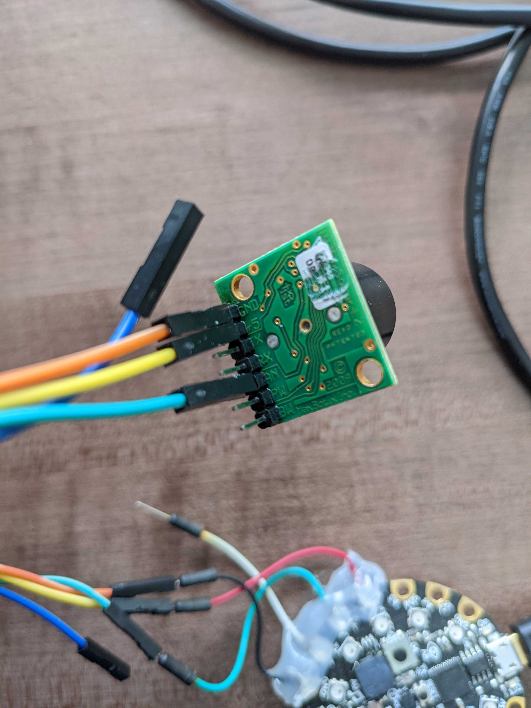
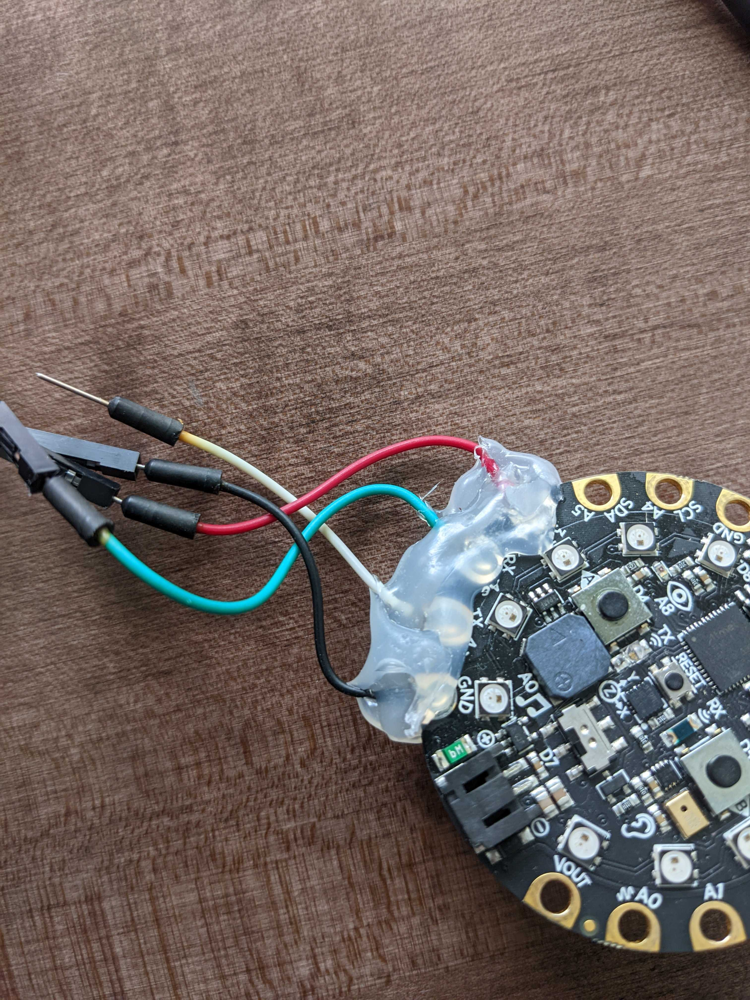

# DDS Halloween Repo

Welcome to the DDS Halloween public github repo, where we show off some of our favorite DIY Halloween projects.  

## PumpkinBot

This is a super easy DIY that acts as both a great intro into programming and hardware, as well as a fun way to upgrade and improve any jack-o'-lantern that you like.  Note that works best with plastic pumpkins but you can use a real one just as easily, as long as its dry on the inside.  It works by using a [Circuit Playground Express](https://www.adafruit.com/product/3333) to light up the pumpkin and generate screaming noise whenever the ultrasonic sensor is triggered.  

### Hardware

- 1x Pumpkin of your choice
- 1x MicroUSB cable for power
- 1x [Circuit Playground Express](https://www.adafruit.com/product/3333)
  - note that the [bluetooth variant](https://www.adafruit.com/product/4333) works as well.  
- 1x Ultrasonic sensor
  - For this project we used the [MB1000-000](https://www.digikey.com/en/products/detail/maxbotix-inc/MB1000-000/7896773)
  - Cheaper sensors like [this](https://www.adafruit.com/product/4007) are also fine, its just a matter of how large you want the sensor to be

### Software

The Circuit Playground Express (CPX) board run using a programming language called CircuitPython, which is basically a microcontroller friendly version of python.  While popular editors like Visual Studio Code will work just fine for writing and editing the program, the [Mu Editor](https://codewith.mu/) is the easiest to use for anyone new to this space, and its what we recommend. 

### Bringing it to life

The base source code for the project can be found [here](./code/).  Simply copy the files and folders onto the CPX, and you should be good to get started.  

For hooking the CPX and sensor together, you will need to decide if you are going to listen over an analog or serial data link.  Most modern ultrasonic sensors will support both, with the main difference being the number of wires needed.  

In our example, we'll be using an analog connection.  

||
| :---: |
|  | 
| Because we are only looking at the analog output of the sensor, that means we only need to attach three wires to the sensor: GND (Ground), +5 (Power), and AN (Analog). |
|  |
| We hook the same three wires up to the CPX, pairing the ground wire to one of the ground pins, the power wire to one of the 3.3V pins, and the Analog wire to whichever pin we plan to read from.  In our code that is pin A6, which is also the RX pin for serial. |
| One optional step that is shown but not needed, is using hot glue to help protect the wires and solder joints on the CPX.  The hot glue just limits how much pressure can be put on the joint, and reduces the likelihood of the wire breaking. |

#### Making it your own

There's a lot of easy ways to change the code, maybe you want the leds to default to a different color, or change to a specific color when the system is triggered.  You can also add and remove screams to the system by placing them into the audio folder on the CPX.  

The CPX is a really great learning board, and we're only touching two of its components in this example, LEDs and Speakers, you can do a lot more with its other components like IR sensors and microphones to make the system remote controllable.  If you want a full breakdown of everything they can do, check out [Adafruit's own guide on the CPX](https://learn.adafruit.com/adafruit-circuit-playground-express/circuitpython-pins-and-modules)